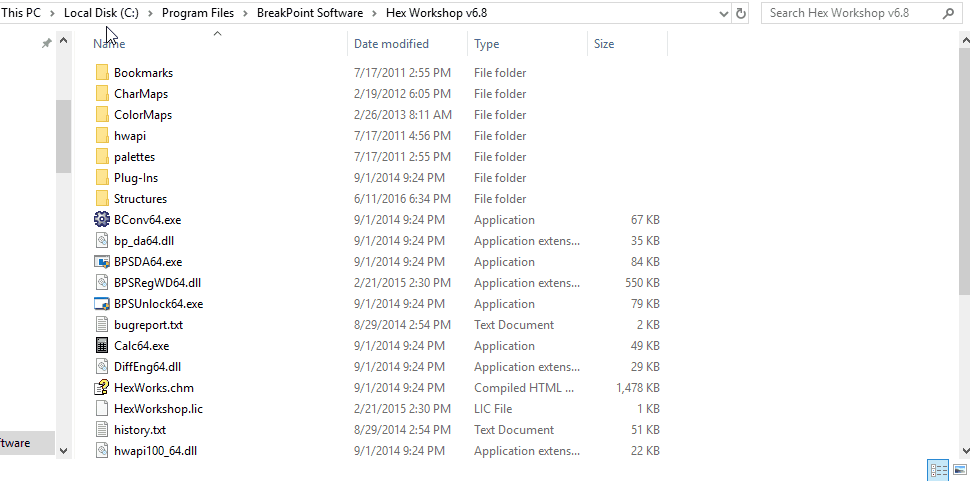
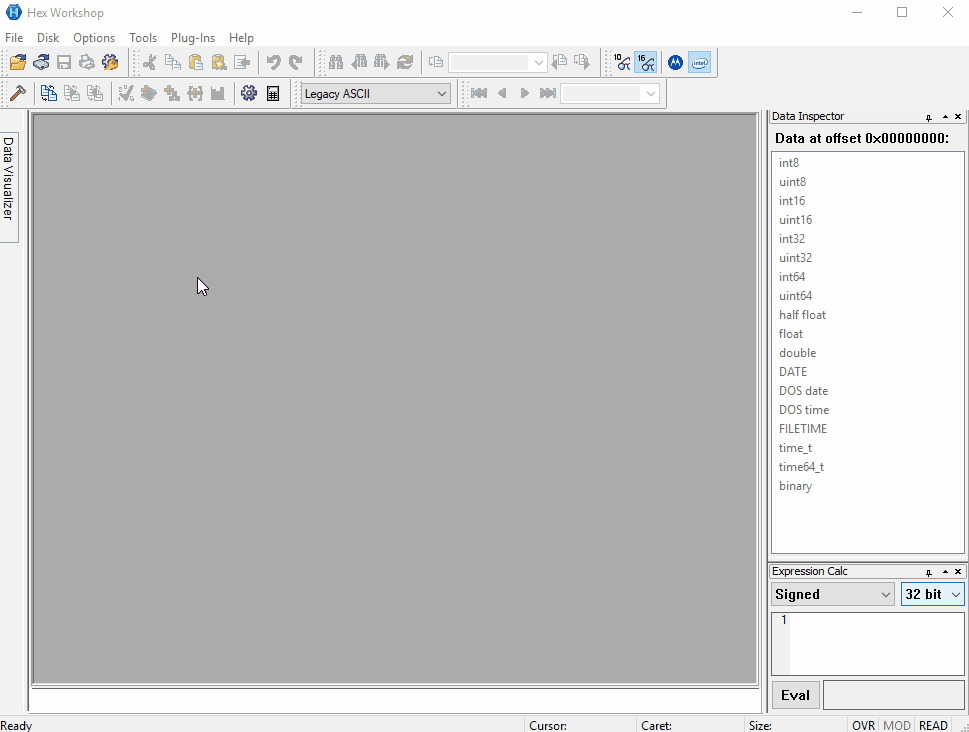
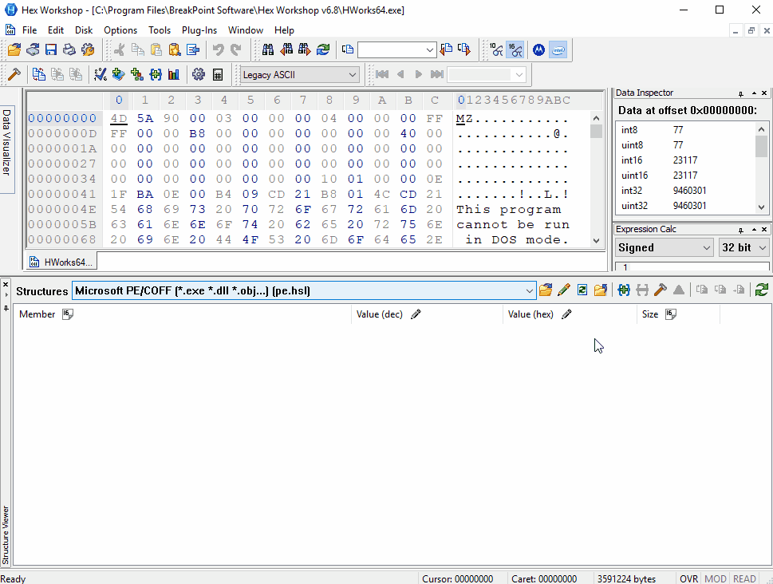
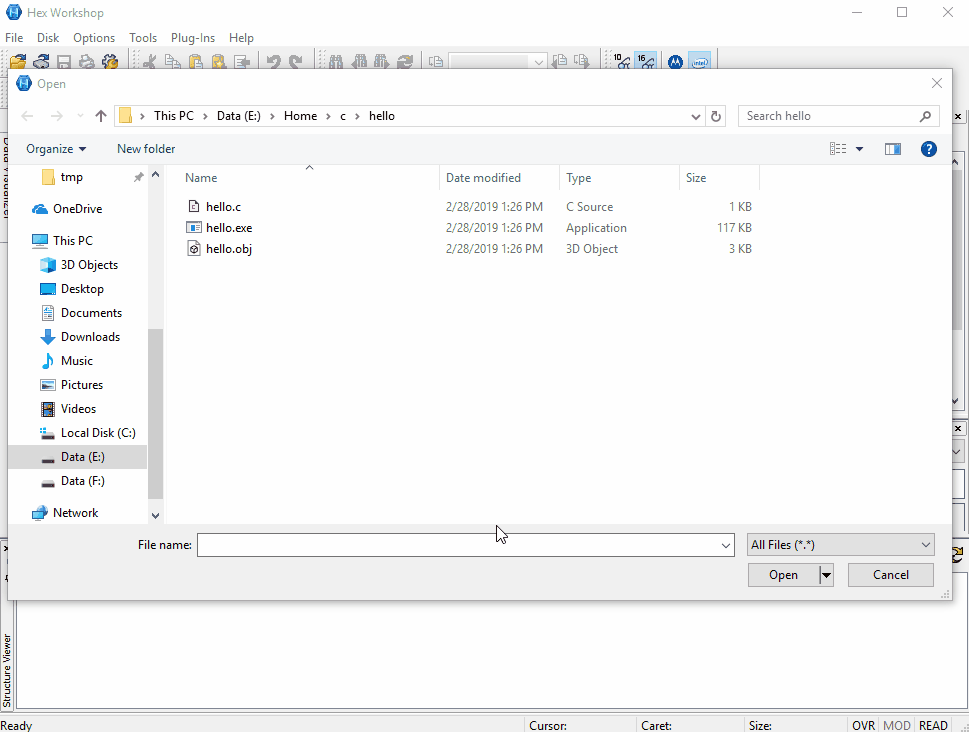
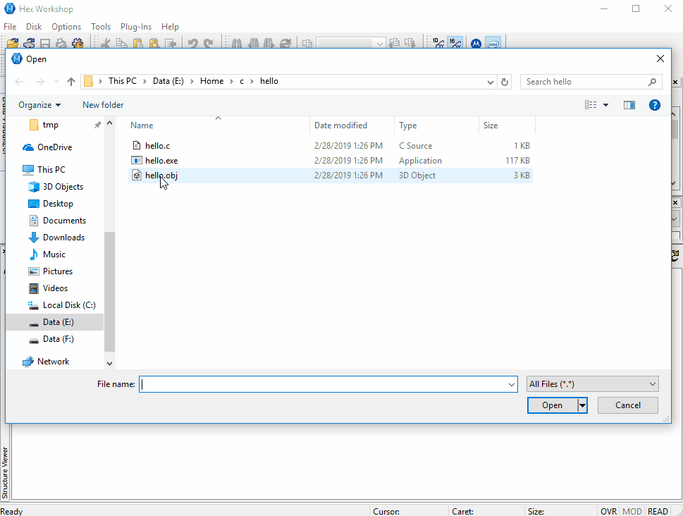

# pe.hsl

*[Hex Workshop](http://www.hexworkshop.com) editor's structure library for the [Microsoft's PE/COFF](https://en.wikipedia.org/wiki/Portable_Executable) file formats.*

The pe.hsl file contains:
- [Structure viewer](http://www.hexworkshop.com/features.html#structures)'s definitions for the PE format (Mostly comes from the [winnt.h](https://docs.microsoft.com/en-us/windows/desktop/api/winnt/) header file).
- An auto-parse function that tries to locate structures based on the [PE format specifications](https://docs.microsoft.com/en-us/windows/desktop/Debug/pe-format).

Common filename extensions for this format includes:
- [exe](https://en.wikipedia.org/wiki/.exe) - Executable program for Windows.
- [dll](https://en.wikipedia.org/wiki/.dll) - Dynamic library for Windows.
- [obj](https://en.wikipedia.org/wiki/Relocatable_Object_Module_Format) - Object file, usualy temporary between [compilation and linking](https://en.wikipedia.org/wiki/Linking_(computing)).
- [lib](https://en.wikipedia.org/wiki/.lib) - Static library produced by Microsoft's compiler.
- [sys](https://en.wikipedia.org/wiki/.sys) - Driver for Windows.
- [mui](https://en.wikipedia.org/wiki/.mui) - Compiled language pack for windows.

Use cases of analysing PE files mostly includes understanding the format, analyse compiled object files and linked executables, manipulating structures to test [loaders](https://en.wikipedia.org/wiki/Loader_(computing)), repair corrupted files, understand malwares, ...

> ### Caveats
>
> - The AutoParseFile function currently supports only PE executable and COFF object files for x86 and AMD64 architectures. ARM is not implemented for example but you are free to contribute if you know the format.
> - If for any reason your pe.hsl file does not have the Windows line-break format the editor will fail loading it. Please ensure that this file only contains CRLF line-breaks.

## Contribution

This software is released into the public domain, so you are free and very welcome to contribute if some structures are missing or the function does not parse a format you would like.

As of the time of writing (2016), Hex Workshop's editor seems to be a discontinued project but it is still the only one advanced enough to propose this structure-way of looking/editing files at a hex editor level using its own scripting language.

## Installation

1. You may either copy the pe.hsl file directly into the Hex Workshop's "Structures" folder place it wherever you want.

2. Show the "Structure Viewer Window" and load the file by clicking on the "Select Structure Library" button.

## Usage

1. Manually adding structures.

2. Using the AutoParseFile function to discover structures.

And for an Object file.

